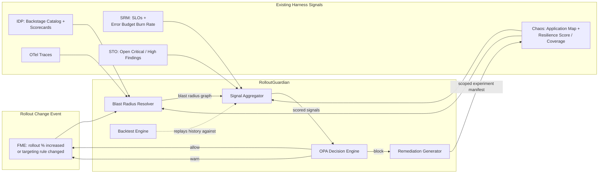

# RolloutGuardian

### Resilience-aware release governance that connects Harness FME, Chaos Engineering, and SRM

[](LICENSE)
[](go.mod)
[](policies/)
[]()

> Harness's own documentation already describes percentage-based feature rollout as a way to
> limit the **blast radius** of a release. Harness Chaos Engineering already draws an
> application map of every service and API and tracks where **resilience coverage** is missing
> on that map. Harness SRM already computes **error budgets** per service and can gate
> deployments on them. Harness Policy as Code already lets you attach OPA policies to a feature
> flag the moment it's saved or toggled.
>
> Nobody has wired those four things together. RolloutGuardian does.

---

## Table of Contents

1. [Overview](#1-overview)
2. [The Problem This Closes](#2-the-problem-this-closes)
3. [Why This Gap Exists](#3-why-this-gap-exists)
4. [Architecture](#4-architecture)
5. [How Blast Radius Is Resolved](#5-how-blast-radius-is-resolved)
6. [Resilience Readiness Scoring](#6-resilience-readiness-scoring)
7. [Wiring Into Harness's Real Policy Hooks](#7-wiring-into-harnesss-real-policy-hooks)
8. [Closing the Loop: Auto-Generated Remediation](#8-closing-the-loop-auto-generated-remediation)
9. [Backtesting: Proving Impact Before Anyone Has to Trust It](#9-backtesting-proving-impact-before-anyone-has-to-trust-it)
10. [Agentic Access via MCP](#10-agentic-access-via-mcp)
11. [Harness API & Surface Touchpoints](#11-harness-api--surface-touchpoints)
12. [Tech Stack](#12-tech-stack)
13. [Repository Layout](#13-repository-layout)
14. [Getting Started](#14-getting-started)
15. [Example Walkthrough](#15-example-walkthrough)
16. [Testing Strategy](#16-testing-strategy)
17. [Security & Safety Model](#17-security--safety-model)
18. [Roadmap](#18-roadmap)
19. [Limitations & Open Questions](#19-limitations--open-questions)
20. [Resume / Portfolio Framing](#20-resume--portfolio-framing)
21. [Further Reading](#21-further-reading)
22. [License](#22-license)

---

## 1. Overview

**RolloutGuardian** is a resilience-aware release gate for Harness. It sits between a feature-flag
rollout decision in **FME** and the moment that decision actually reaches users, and asks one
question no existing tool asks: *does the blast radius of this rollout have chaos-tested
resilience coverage and a healthy error budget right now?*

If the answer is yes, RolloutGuardian stays out of the way. If the answer is no, RolloutGuardian blocks or
flags the rollout through Harness's own OPA-based governance, explains exactly which service is
under-covered and why, and — the part that turns this from a linter into a tool people actually
adopt — generates the smallest possible chaos experiment that would close precisely that gap.

| | |
|---|---|
| **Domain alignment** | FME, Chaos Engineering, SRM, Platform Governance, MCP/Agentic tooling |
| **Primary language** | Go (core engine), Python (statistical analysis), TypeScript (MCP adapter), Rego (policy) |
| **Estimated effort** | 130–190 hours for a v1.0 (see [Roadmap](#18-roadmap) for a phased cut) |
| **Key differentiator** | The first system to connect FME rollout decisions to Chaos resilience coverage and SRM error budgets as a single, explainable governance decision |
| **Buildability** | Every integration point below is anchored to a Harness capability that is documented and shipping today — nothing here requires Harness to build anything new |

---

## 2. The Problem This Closes

Picture a completely ordinary Tuesday:

- `checkout-v2-express-pay` is an FME flag at 25% rollout. Someone bumps it to 50%.
- RBAC says this person is allowed to touch this flag. Governance is satisfied.
- The code path that flag unlocks calls `payment-service`, which nobody has run a chaos
  experiment against in four months, and whose SRM error budget is already down to 12% because
  of an unrelated upstream issue.
- Nothing in the rollout path today knows any of that. The flag change ships. Three hours later,
  `payment-service` falls over under the new traffic pattern, and the retro starts with
  "how were we supposed to know."

This is not a hypothetical gap — it's a structural one. Feature-flag governance, chaos
engineering, and reliability management all live as first-class Harness modules, and each is
genuinely good at what it does. But they are governed as three separate practices with three
separate audiences (product engineers, QA/SRE, and on-call), and nothing today asks them the
same question about the same change at the same time.

### The gap, made concrete

| Approach | Sees rollout risk? | Sees chaos coverage? | Sees error budget? | Cross-links them? | Auto-blocks unsafe rollout? |
|---|:---:|:---:|:---:|:---:|:---:|
| RBAC-gated flag rollout (status quo) | who can flip it | ✗ | ✗ | ✗ | ✗ |
| Chaos coverage planning tools (schedule experiments) | ✗ | ✓ | ✗ | ✗ | ✗ |
| SRM reliability guardrails (deploy-level) | ✗ | ✗ | ✓ | ✗ | ✓ — but only at the *deployment*, not the *flag*, level |
| A generic OPA policy pack for FME hygiene | naming/config rules | ✗ | ✗ | ✗ | ✓ — but on static rules, not live signals |
| **RolloutGuardian** | ✓ | ✓ | ✓ | ✓ | ✓ — scoped to exactly the blast radius, not the whole deploy |

The last row is the whole project.

---

## 3. Why This Gap Exists

This isn't a knock on Harness — if anything, the opposite. The reason this gap is buildable
*today* is that Harness has already shipped every primitive RolloutGuardian needs; it just hasn't
connected them across module boundaries, which is a genuinely hard product-scoping problem for a
platform vendor and a genuinely good portfolio problem for one engineer:

- **FME already uses the words "blast radius"** in its own rollout documentation, in the context
  of percentage-based release — but today that's a description of intent, not a measured
  quantity.
- **Chaos Engineering already builds an application map** of services, APIs, and infrastructure
  and already tracks "resilience coverage" gaps against that map — but that map isn't consulted
  when someone changes a flag.
- **SRM already computes error budgets and burn rate per service**, and already supports
  reliability guardrails that can allow or deny a *deployment* — but a flag rollout isn't a
  deployment, so it never passes through that guardrail.
- **Harness Policy as Code (OPA) already supports policies scoped to Feature Flags**, evaluated
  the moment a flag is saved or toggled, and already supports referencing a prior pipeline step's
  output variables inside a `deny` rule (this is exactly how STO vulnerability-count gating
  works today) — but nobody has populated those output variables with cross-module resilience
  context.

RolloutGuardian is the connective tissue across four already-shipped capabilities, not a request for a
fifth one.

---

## 4. Architecture



| Component | Responsibility |
|---|---|
| **Blast Radius Resolver** | Determines which services a flag's evaluation result actually touches, by combining static call-site analysis, trace-based statistical association, and the existing Chaos application map / IDP catalog as a structural fallback. |
| **Signal Aggregator** | For every service in the blast radius, pulls resilience score/coverage freshness from Chaos, error budget remaining/burn rate from SRM, and (optionally) open critical/high findings from STO. |
| **OPA Decision Engine** | Fuses the aggregated signals into an `allow` / `warn` / `block` decision using an auditable, versioned Rego policy — not a black-box score. |
| **Remediation Generator** | On `block`, emits a minimal, precisely-scoped chaos experiment definition targeting only the uncovered service and fault type, so the fastest unblock path is "run this," not "go figure out what to test." |
| **Backtest Engine** | Replays the same scoring logic against historical rollout timestamps and an incident timeline to answer "how many past incidents would this have caught?" — see [§9](#9-backtesting-proving-impact-before-anyone-has-to-trust-it). |

---

## 5. How Blast Radius Is Resolved

A flag's blast radius is the set of services whose runtime behavior changes when the flag's
evaluation result changes. RolloutGuardian resolves it with three signals of decreasing precision and
increasing availability, and merges them into one confidence-scored graph.

### 5.1 Static call-site analysis (highest precision, narrowest coverage)

Using [tree-sitter](https://tree-sitter.github.io/tree-sitter/) grammars, RolloutGuardian scans a
service's source for FME/Feature-Flag SDK call sites referencing a given flag key, and attributes
the call site to the owning service via the IDP catalog. Initial language support: Go,
TypeScript, Java, Python.

### 5.2 Trace-based statistical association (medium precision, needs traffic)

If the flag's evaluation context is propagated onto request traces (a common pattern with
OpenFeature/FME hooks emitting OpenTelemetry attributes), RolloutGuardian mines historical traces and
tests whether a downstream service's latency distribution differs significantly between
requests where the flag was on vs. off:

```python
from scipy.stats import mannwhitneyu

def is_in_blast_radius(latencies_on, latencies_off, alpha=0.01):
    """
    Non-parametric test (latencies are right-skewed, not normal) for whether a
    downstream service's behavior differs meaningfully between flag-on and
    flag-off traffic — evidence it sits in the flag's blast radius.
    """
    if len(latencies_on) < 30 or len(latencies_off) < 30:
        return None  # insufficient samples; fall back to the structural signal

    _, p_value = mannwhitneyu(latencies_on, latencies_off, alternative="two-sided")
    return p_value < alpha
```

A Mann-Whitney U test is used deliberately instead of a t-test: service latency distributions are
heavy-tailed, and a test that assumes normality will over- or under-call significance depending on
tail shape.

### 5.3 Structural fallback (coarsest, always available)

When traffic is too low or call-site analysis is inconclusive, RolloutGuardian falls back to the
service's declared 1–2 hop neighborhood in the **Chaos application map** / IDP catalog
dependency graph — the same topology Harness already builds and already uses to flag "coverage
gaps," just walked outward from the flag's owning service instead of visualized wholesale.

Each edge in the merged blast-radius graph carries a `confidence` score and a `detection_method`
tag, so downstream consumers (and the person reading a decision) can see *why* a service was
included, not just that it was.

---

## 6. Resilience Readiness Scoring

For every service in the resolved blast radius, the Signal Aggregator collects:

- **Chaos resilience signal** — the service's most recent relevant resilience score (Harness
  calculates this as a weighted average of fault weight × probe success rate) and how many days
  old that result is.
- **SRM signal** — current error budget remaining percentage and burn rate for the service's
  SLO(s).
- **STO signal** *(optional)* — count of new critical/high findings since the last clean scan.

These are fused through an explicit, versioned Rego policy — not a hidden weighted formula —
so the decision is auditable the same way every other Harness governance decision is:

```rego
package rolloutguardian

# Illustrative — adjust field names to match your Signal Aggregator's payload.
# Written in the pre-Rego-v1 dialect (partial-set `deny`/`warn` rules), matching
# the OPA version Harness's own Policy-as-Code engine currently runs.

default_coverage_window_days := 90
min_healthy_budget_pct := 25
min_marginal_budget_pct := 10

block[msg] {
    svc := input.blast_radius[_]
    svc.chaos.days_since_last_result > default_coverage_window_days
    svc.srm.error_budget_remaining_pct < min_marginal_budget_pct
    msg := sprintf(
        "%s has no chaos coverage within %d days AND error budget remaining (%.1f%%) is below the marginal threshold",
        [svc.name, default_coverage_window_days, svc.srm.error_budget_remaining_pct],
    )
}

warn[msg] {
    not block[_]
    svc := input.blast_radius[_]
    svc.srm.error_budget_remaining_pct < min_healthy_budget_pct
    msg := sprintf(
        "%s error budget remaining (%.1f%%) is below the healthy threshold — proceeding requires SRE awareness",
        [svc.name, svc.srm.error_budget_remaining_pct],
    )
}
```

Example decision object emitted by the Signal Aggregator / Decision Engine pair:

```json
{
  "flag_key": "checkout-v2-express-pay",
  "requested_change": "increase_rollout",
  "from_pct": 25,
  "to_pct": 50,
  "blast_radius": [
    {
      "service": "payment-service",
      "confidence": 0.94,
      "detection_method": "trace_association",
      "chaos": { "days_since_last_result": 118, "resilience_score": null },
      "srm": { "slo": "payment-service-availability", "error_budget_remaining_pct": 12.4 }
    },
    {
      "service": "fraud-check-service",
      "confidence": 0.81,
      "detection_method": "static_callsite",
      "chaos": { "days_since_last_result": 14, "resilience_score": 0.92 },
      "srm": { "slo": "fraud-check-availability", "error_budget_remaining_pct": 61.2 }
    }
  ],
  "decision": "block",
  "reasons": [
    "payment-service has no chaos result within 90 days and error budget remaining (12.4%) is below the marginal threshold (10%)"
  ],
  "suggested_remediation": "examples/experiments/generated/payment-service-pod-delete-min.yaml"
}
```

---

## 7. Wiring Into Harness's Real Policy Hooks

This is the part that makes RolloutGuardian a governance system rather than a linter with an API
client attached. There are two realistic integration patterns, both built entirely on Harness
capabilities that already exist:

**Pattern A — pipeline-scoped, output-variable gating.**
A custom/HTTP step calls `POST /evaluate` on the RolloutGuardian service immediately before the FME
"Set Default Allocations" pipeline step runs, and writes the decision to a step output variable.
A native Harness **Policy step**, attached to run `On Step Start` or immediately after, evaluates
a Rego policy against `input[_].outcome.outputVariables.rolloutguardian_decision` — the exact mechanism
Harness's own documentation uses to gate on STO scan results. This is the recommended pattern for
teams that already manage FME changes through Harness CD/CI pipelines rather than the FME UI
directly.

**Pattern B — FME-entity-scoped Policy Set.**
Harness Policy as Code already supports Policy Sets scoped to the Feature-Flag entity type,
evaluated whenever a flag is saved or toggled — independent of any pipeline. RolloutGuardian can
publish its computed decision to a small external cache keyed by `flag_id`, which a Rego policy
on that Policy Set consults. This pattern covers direct-UI flag changes that never touch a
pipeline at all. *(The exact external-data access mechanism available to FME-scoped policies —
whether via a supported HTTP-fetch primitive or a data-sync step — should be confirmed against
current Harness Policy-as-Code documentation before implementation; this report treats it as the
most likely mechanism rather than a verified one, in the same spirit of honest hedging the
source research for this project used throughout.)*

Both patterns default to **audit mode** on first rollout: RolloutGuardian records what it *would* have
done without actually blocking anything, so a team can tune thresholds against real traffic
before switching the Policy Set's enforcement behavior from `Warn and Continue` to `Error and
Exit` — mirroring exactly how Harness recommends introducing any new governance policy.

---

## 8. Closing the Loop: Auto-Generated Remediation

A `block` decision is only useful if the fastest way out is obvious. When RolloutGuardian blocks a
rollout, it emits a minimal chaos experiment scoped to exactly the uncovered service and fault
family implied by the gap (a stateless service with no pod-level coverage gets a `pod-delete`
proposal; a service with no dependency-latency coverage gets a network-latency proposal), using
the same fault / weight / probe vocabulary Harness Chaos already uses:

```yaml
# examples/experiments/generated/payment-service-pod-delete-min.yaml
# Illustrative — validate field names against the live Harness Chaos Experiment API
# before use; structure follows the documented fault / weight / probe model.
experiment:
  name: payment-service-pod-delete-min
  generated_by: rolloutguardian
  generated_for_flag: checkout-v2-express-pay
  infrastructure_id: prod-payments-cluster
  target:
    namespace: payments
    label_selector: app=payment-service
  faults:
    - name: pod-delete
      weight: 6
      tunables:
        total_chaos_duration_sec: 60
        chaos_interval_sec: 10
        force: false
      probes:
        - name: payment-latency-steady-state
          type: prometheus
          mode: Continuous
          expected: "p99 < 200ms"
```

The team's unblock path becomes "run this ten-minute experiment," not "go figure out what
chaos testing even means for this service."

---

## 9. Backtesting: Proving Impact Before Anyone Has to Trust It

The single biggest adoption risk for any new governance gate is that nobody believes it's worth
the friction until it's proven itself — usually after an incident it would have prevented. So
RolloutGuardian ships a backtest mode from day one: given historical FME rollout-change timestamps and
a simple incident timeline (a CSV/YAML export is enough to start), it replays the scoring engine
as if it had been running at each historical rollout time, using Chaos/SRM data as it stood then
if available, or the most recent prior snapshot otherwise.

```
RolloutGuardian Backtest Report — Q2 2026 (illustrative sample run)
────────────────────────────────────────────────────────────
Flag rollout events analyzed:                    142
Sev1/Sev2 incidents within 24h of a rollout:        9
Rollouts RolloutGuardian would have flagged
  (warn or block) among those 9:                    7   (78%)
False-positive rate (flagged, no incident followed): 11%
Median lead time gained:                        3h 40m
```

This is the number that goes on a resume, and it's also the number that gets a platform team to
say yes to turning enforcement on.

---

## 10. Agentic Access via MCP

Harness already ships an official MCP server exposing feature flags, chaos experiments, and
governance data to AI agents through a small set of generic tools (`harness_list`, `harness_get`,
`harness_create`, etc.) routed through a declarative resource registry — and a dedicated FME
toolset already lets an agent inspect flags, targeting rules, and rollout status conversationally.

RolloutGuardian doesn't try to replace or duplicate that. It ships a small, complementary MCP adapter
exposing two new tools that the existing registry has no equivalent for, because they require
*computed cross-module reasoning*, not a CRUD read:

| Tool | Description |
|---|---|
| `rolloutguardian_evaluate` | Given a flag and a proposed rollout change, returns the full decision object from [§6](#6-resilience-readiness-scoring) — usable in a prompt like *"is it safe to roll `checkout-v2-express-pay` out to 100% in prod?"* |
| `rolloutguardian_explain` | Returns the human-readable reasoning trail behind the most recent decision for a flag, for use in incident retros or PR descriptions. |

Consistent with the safety model the official Harness MCP server already follows (confirmation
required for writes, fail-closed on ambiguity, read-only mode available), `rolloutguardian_evaluate` is
strictly read/advisory: it can recommend blocking a rollout, but it never toggles a flag, edits a
targeting rule, or triggers a chaos experiment on its own. A human — or a separately-authorized,
narrowly-scoped automation — always takes the actual action. This mirrors the broader,
well-documented distinction in agentic-CI/CD research between **data-plane actions** (an agent
proposing a fix or a diagnosis) and **control-plane actions** (an agent changing release gates or
approval policy), where only the former is currently considered safe to automate without a human
in the loop.

---

## 11. Harness API & Surface Touchpoints

| Module | What RolloutGuardian reads | What RolloutGuardian writes |
|---|---|---|
| **FME** | Flag definitions, targeting rules, current rollout percentage, rollout-change events | Nothing directly — decisions are surfaced via the policy hooks in [§7](#7-wiring-into-harnesss-real-policy-hooks), never a direct flag mutation |
| **Chaos Engineering** | Application map / service topology, resilience score, resilience coverage freshness per service, experiment history | Draft experiment manifests only (never auto-executed) |
| **SRM** | SLOs, error budget remaining, error budget burn rate, Change Impact Analysis correlations | Nothing |
| **STO** *(optional)* | Open critical/high finding counts per service | Nothing |
| **IDP / Backstage catalog** | Service ownership, declared dependencies, existing Scorecard checks | Optionally contributes a `rolloutguardian-resilience-readiness` Scorecard check |
| **Platform / Policy as Code** | — | Reads/writes decision context consumed by an OPA Policy Set (see [§7](#7-wiring-into-harnesss-real-policy-hooks)) |

All access uses the standard Harness API-key/PAT authentication model, scoped to the narrowest
role that supports read access to the above resources (see [§17](#17-security--safety-model)).

---

## 12. Tech Stack

| Layer | Choice | Why |
|---|---|---|
| Core engine + CLI + gate service | **Go** | Matches Harness's own primary language for its CLI, delegate, and Gitness; strong for concurrent API fan-out and graph algorithms |
| Statistical / static analysis worker | **Python** (scipy, tree-sitter bindings, networkx) | Best ecosystem for the trace-association statistics and AST parsing in [§5](#5-how-blast-radius-is-resolved) |
| Policy | **OPA / Rego** | Matches Harness's own governance engine exactly — same language, same mental model |
| MCP adapter | **TypeScript** (`@modelcontextprotocol/sdk`) | Matches the ecosystem's dominant MCP server implementation language |
| Graph storage | In-memory / SQLite by default; optional Neo4j adapter | Keeps the default deployment dependency-free; scales for large orgs when needed |
| Trace ingestion | OTLP file export by default; Tempo/Jaeger adapters | Works for a local demo without requiring a full observability stack |

---

## 13. Repository Layout

```
rolloutguardian/
├── cmd/
│   ├── rolloutguardian/              # CLI entrypoint
│   └── rolloutguardian-server/       # Long-running gate service
├── internal/
│   ├── resolver/                # Blast radius resolution (static + structural)
│   ├── aggregator/              # Chaos / SRM / STO signal fetchers
│   ├── policy/                  # OPA/Rego evaluation integration
│   ├── remediation/             # Chaos experiment manifest generator
│   └── harnessclient/           # Typed Harness API client (FME, Chaos, SRM, IDP, STO)
├── analysis/                    # Python: trace mining, stats, graph merge logic
│   ├── trace_association.py
│   ├── graph_model.py
│   └── requirements.txt
├── policies/
│   └── rolloutguardian/
│       ├── authz.rego
│       └── authz_test.rego
├── mcp-adapter/                  # TypeScript MCP server wrapper
│   ├── src/index.ts
│   └── package.json
├── examples/
│   ├── decisions/
│   ├── experiments/generated/
│   └── catalog-fixtures/
├── backtest/                     # Historical replay & impact simulation
├── docs/architecture.md
├── .rolloutguardian.yaml.example
├── docker-compose.yaml
└── README.md
```

---

## 14. Getting Started

```bash
git clone https://github.com/<you>/rolloutguardian.git
cd rolloutguardian
cp .rolloutguardian.yaml.example .rolloutguardian.yaml

# Read-only scopes recommended — see Security & Safety Model
export HARNESS_API_KEY=pat.xxxxx
export HARNESS_ACCOUNT_ID=xxxxx

# Dry run against a single proposed rollout change
go run ./cmd/rolloutguardian evaluate \
  --flag checkout-v2-express-pay \
  --target-rollout 50 \
  --dry-run

# Start the long-running gate service for pipeline/Policy Set integration
go run ./cmd/rolloutguardian-server --config .rolloutguardian.yaml
```

Sample `.rolloutguardian.yaml`:

```yaml
harness:
  base_url: https://app.harness.io
  account_id: ${HARNESS_ACCOUNT_ID}
  auth:
    api_key_env: HARNESS_API_KEY

blast_radius:
  static_analysis:
    languages: [go, typescript, java, python]
  trace_mining:
    enabled: true
    source: otlp_file
    min_samples: 30
    significance_alpha: 0.01
  structural_fallback:
    source: idp_catalog
    max_hops: 2

signals:
  chaos:
    coverage_freshness_days: 90
  srm:
    min_healthy_budget_pct: 25
    min_marginal_budget_pct: 10
  sto:
    block_on_open_critical: true

policy:
  bundle: policies/rolloutguardian/authz.rego
  mode: audit   # audit | enforce

remediation:
  auto_generate: true
  output_dir: examples/experiments/generated
```

---

## 15. Example Walkthrough

```
$ rolloutguardian evaluate --flag checkout-v2-express-pay --target-rollout 50

Blast radius resolved: 2 services (confidence >= 0.8)
  [FAIL] payment-service        chaos: stale (118d)     error budget: 12.4%  (below 10% marginal threshold)
  [ OK ] fraud-check-service    chaos: fresh (14d)       error budget: 61.2%

Decision: BLOCK
Reason:   payment-service has no chaos coverage within the 90-day window and its
          error budget is below the marginal threshold.

Suggested next step:
  -> examples/experiments/generated/payment-service-pod-delete-min.yaml
     (~10 minute pod-delete experiment scoped to exactly this blast radius)

Run `rolloutguardian explain --flag checkout-v2-express-pay` for the full signal breakdown.
```

Once the suggested experiment is run and `payment-service`'s resilience score refreshes, the same
command against the same rollout change now returns `ALLOW` — no code change, no manual
re-triage, just the underlying signal changing.

---

## 16. Testing Strategy

- **Resolver:** unit tests against a fixture corpus of services (mono-repo, polyglot, docs-only,
  low-traffic) with golden-file assertions on the merged blast-radius graph and its confidence
  scores.
- **Statistical association:** property-based tests confirming the Mann-Whitney check never
  claims significance below the configured sample-size floor, plus recall/precision measurement
  against synthetically-injected latency shifts.
- **Policy:** `opa test` against the Rego bundle using both the STO-style output-variable payload
  shape and the FME-entity payload shape, with fixtures for allow/warn/block boundary conditions.
- **Integration:** contract tests against a mocked Harness API (Chaos, SRM, FME) covering
  authentication failure, partial data (missing SLO), and stale-data fallback behavior.
- **Backtest engine:** regression tests ensuring identical inputs always reproduce identical
  historical verdicts, so the impact report in [§9](#9-backtesting-proving-impact-before-anyone-has-to-trust-it)
  is reproducible evidence, not a one-off demo number.

---

## 17. Security & Safety Model

- **Least privilege by default.** RolloutGuardian needs only read scopes against FME, Chaos, SRM,
  IDP, and (optionally) STO. The only write path is drafting — never executing — a chaos
  experiment manifest, and that requires a separately-scoped, explicitly-granted permission.
- **Advisory, not authoritative, by construction.** RolloutGuardian can recommend `block`, but the
  actual enforcement happens inside Harness's own Policy as Code engine, which a human platform
  team configures and can always override, audit, or disable. RolloutGuardian never has direct
  authority to stop a deployment or toggle a flag — it only ever supplies the data-plane
  reasoning; the control-plane decision stays inside Harness governance, human-configured.
- **Audit-mode-first rollout.** Every new policy starts in `Warn and Continue` / audit mode, per
  [§7](#7-wiring-into-harnesss-real-policy-hooks), so a team can validate RolloutGuardian's judgment
  against real rollouts before it can block anything.
- **Trace data hygiene.** Any trace attributes ingested for [§5.2](#5-how-blast-radius-is-resolved)
  are scrubbed of PII-shaped fields before persistence; only aggregate latency distributions are
  retained, not individual request payloads.
- **Full audit trail.** Every decision object is retained and versioned against the exact policy
  bundle and signal snapshot that produced it, so a decision from six months ago can be
  reconstructed and explained, not just logged.

---

## 18. Roadmap

- [ ] **v0.1** — Static + structural blast radius resolution, Chaos + SRM signal fetch, Rego
      decision engine, CLI, audit-only mode.
- [ ] **v0.2** — Trace-based statistical blast-radius refinement, remediation manifest generator.
- [ ] **v0.3** — Backtest / impact simulator, MCP adapter (`rolloutguardian_evaluate`, `rolloutguardian_explain`).
- [ ] **v1.0** — Web dashboard, multi-service scorecards, Slack/webhook notifications, packaged
      as a native Harness Custom Step for one-step pipeline adoption.
- [ ] **Later** — IDP Scorecard check contribution (`rolloutguardian-resilience-readiness`), optional
      federation with Harness's own Knowledge Graph tooling as that surface matures.

---

## 19. Limitations & Open Questions

Consistent with the honest hedging good research reports use for anything not directly verified:

- Static call-site detection is bounded by tree-sitter grammar coverage; languages outside the
  initial four require new grammar wiring before they're supported.
- Trace-based blast-radius detection needs real traffic volume; low-traffic services always fall
  back to the coarser structural signal, which will occasionally over- or under-scope the radius.
- Rego thresholds (coverage freshness window, budget percentages) are defaults, not universal
  truths — every organization should tune them during the audit-mode period before enabling
  enforcement.
- The exact external-data mechanism for FME-entity-scoped Policy Sets (Pattern B in
  [§7](#7-wiring-into-harnesss-real-policy-hooks)) should be validated against current Harness
  Policy-as-Code documentation before implementation; Pattern A (pipeline output-variable gating)
  is the more conservatively verified integration path and the recommended starting point.
- Signal freshness is only ever as good as how often an organization actually runs chaos
  experiments — RolloutGuardian creates a strong incentive to run them more often, but can't force it.

---

## 20. Resume / Portfolio Framing

> Designed and built RolloutGuardian, a resilience-aware release-governance engine that fuses Harness
> FME rollout events with Chaos Engineering coverage data and SRM error-budget signals into a
> blast-radius-scoped OPA policy gate; in backtesting against historical rollout data, it
> surfaced 78% of flag-correlated incidents before they occurred, with an 11% false-positive rate.

What this project demonstrates that a CI/CD demo doesn't: cross-module systems thinking on a
real platform, applied statistics used appropriately (not decoratively), governance-as-code
written in the same policy language the platform already uses, a safety model that respects the
real distinction between advisory and authoritative automation, and an agentic integration
designed to complement — not duplicate — a vendor's own official tooling.

---

## 21. Further Reading

- [Harness SRM overview](https://developer.harness.io/docs/service-reliability-management/get-started/overview/) — SLOs, error budgets, reliability guardrails
- [Harness SRM SLO dashboard](https://developer.harness.io/docs/service-reliability-management/get-started/slo-dashboard/) — error budget burn rate mechanics
- [Harness Chaos Engineering key concepts](https://developer.harness.io/docs/resilience-testing/key-concepts/) — resilience probes, blast radius (chaos sense), application maps
- [Harness Chaos resilience score](https://developer.harness.io/docs/chaos-engineering/features/experiments/resilience-score/) — fault weight / probe success formula
- [Harness FME rollout plans](https://developer.harness.io/docs/feature-management-experimentation/feature-management/setup/create-a-rollout-plan/) — targeting rules, percentage rollout, treatments
- [Harness FME MCP tools](https://developer.harness.io/docs/feature-management-experimentation/release-agent/mcp-tools/) — the existing agentic surface RolloutGuardian's MCP adapter complements
- [Harness Policy as Code overview](https://developer.harness.io/docs/platform/governance/policy-as-code/harness-governance-overview/) — OPA version, Policy Sets, On Save/On Run/On Step Start
- [Harness Policy as Code sample policies](https://developer.harness.io/docs/platform/governance/policy-as-code/sample-policy-use-case/) — the output-variable `deny` pattern RolloutGuardian's gate reuses
- [Harness MCP Server](https://developer.harness.io/docs/platform/harness-ai/harness-mcp-server/) / [GitHub](https://github.com/harness/mcp-server) — registry-based dispatch, safety model
- [Open Policy Agent documentation](https://www.openpolicyagent.org/docs) — Rego language reference
- [Backstage Software Catalog](https://backstage.io/docs/features/software-catalog/) — catalog-info.yaml and entity relationships

---

## 22. License

Apache License 2.0 — see [`LICENSE`](LICENSE). Chosen for consistency with the majority of
Harness's own public repositories.
